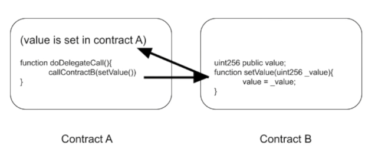
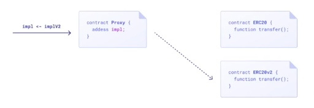
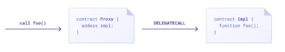
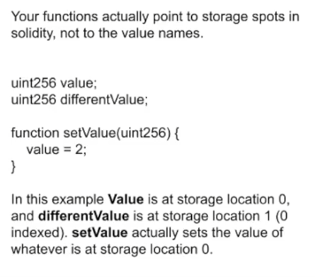
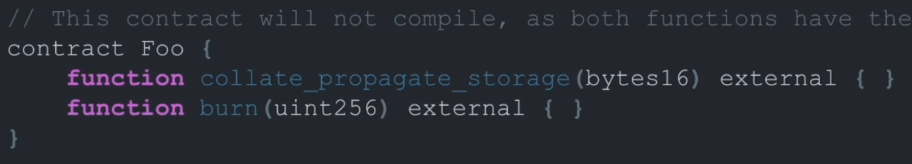
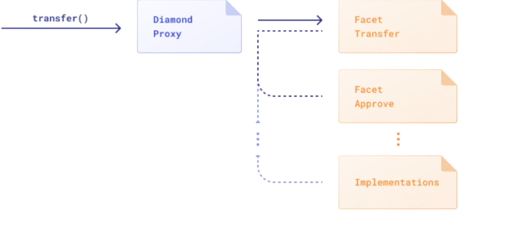
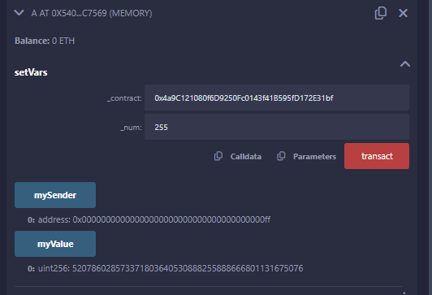

# upgradeable Smart Contracts Lesson Notes

## Lesson and Project Overview

This lesosn looks to explore what upgradeable smart contracts are, proxies, how they are carried out, what are the components that allow upgradeable smart contracts, their advantages and risks, best practises, how to deploy one and how to upgrade a smart contract.

## upgradeable Smart Contracts Introduction

We understand and have explored before how smart contracts on the ethereum blockchain are immutable and and transactions are verifiable which really boosts the security and decentralisation aspects of why this technology is so cool! However, this isn't the full story. Obviously the storage variables that a smart contract uses and are stored on the blockchain can be changed in value, the immutability reference comes from the idea that the core functioning and logic of a smart contract don't change. Now while the smart contract deployed at an address are immutable in that sense, there are actually methods that can be used to update smart contracts functionality post deployment on the blockchain - this is a concept called upgradeable Smart Contracts.

Because of this ability to upgrade functionality of smart contracts, and often leaning away from decentralisation towards centralisation that allows small groups of individuals to make changes, the industry has, for the most part, made the determination that for the most part upgradeable contracts are bad. However, they do exist and are used and therefore we need to learn about them, especially for my security journey.

### 3 Methods to Upgrade your Smart Contract

1. The not-really/paramaterise method
    - Can't add new storage
    - Can't add new logic
    - Things like accpeted tokens as a param value in setter function, or change the reward of fee value using a setter function
    - This method is simple but not flexible
    - Consideration for: who are the admins? Who can use the functions? Could be breaking decentralised approach. Could add a DAO goverance protocol to be the admin and be decentralised, as long as the DAO is decentralised
2. Social Migration Method
    - This method doesn't involve changing anything at all with the deployed smart contract, but rather deploying the upgraded smart contract and then bringing the people over to use the upgraded contract. The upgrade is completed by simply brining th epeople over from the old smart contract to the new one.
    - This is the truest form of immutable smart contract since we really do not change the smart contract, we just provide a new one to use.
    - These are also the easiest form of contracts for audting compared to some other methods of upgrading smart contracts
    - Need to consider the amount of work and effort involved in bringing users to the new smart contract, which again, is at a different location with a new contract address
    - You are now dealing with multiple smart contract addresses and this needs to be a consideration - do you need to approach a whole bunch of protocols that used the old address to now use the new address?
    - Need to move the state of the old contract to the new upgraded one
3. Proxies
   1. Metamorphic proxies
   2. Transparent upgradeable proxies
   3. Universal upgradeable proxies
   4. Diamon Proxies

## Proxy Deep-Dive

Proxies allow useras to keep interacting with smart contract and the smart contract could be upgraded and the user smight not even be aware that changes were made. However, this is also where the biggest mistakes can be made!

Proxies often work at the lower-levels of functionality, mainly the **delegatecall function**, which is a special variant of a standard call but actually executes code at the target address that it is calling inside the contract making the delegatecall function, all while mainting the original msg.sender and msg.value values. We can also leverage fallback functions to help out this type of processing.

All proxies to be discussed have an Ethereum Proposal - EIP

***What does it mean in plain language?**

It means that if there are 2 smart contracts, contract A and contract B, and contract B has functions we want to use that contract A doesn't have, contract A can use **delegatecall** to use the functions of contract B but store the data and its variables that it updates in contract A and we don't touch the storage of contract B. Because all the storeage variables are in the proxy contract, it means we don't have to worry about migrating the state across for the new upgraded contract to be used.



What this allows is the deployment of a proxy contract that will always maintain one contract address for users to use, but the proxy contract can steer users requests and point them at different contracts, allowing upgraded contracts to be deployed and the proxy contract just simply redirecting users to the upgraded contract.





### Proxy Terminology

1. Implementation Contract:
    - Contains all our code of our protocl. When we upgrade, we launch a brand new implementation contract.
2. Proxy contract:
   - Contract which points to which implementation is the "correct" one, and routes everyone's function calls to that contract. Normally there is a restricted access setter function to change which contract to point at.
3. User
   - They are those that make the function calls that go through the proxy.
4. The admin:
   - Thi is the user (or group of users/voters) who upgrade to new implementation contracts. When to upgrad eand which contract to point to.

### Proxy 'Gotcha's!' to be aware of

Two biggest issues are:
1. Storage clashes
   - Even though we are calling the functions inside of another contract and storing the data in the proxy, we don't actually dynamically assign values to storage slots in memory based on varaible names. Instead, functions actually point to storage slot locations. This means that the order of storage variables that are defined actually indicates which storage memory slot the value is.
   
   - This means we can ONLY APPEND new storage variables in upgraded smart contracts using proxies, otherwise we will have storage clashes and create a whole bunch of issues, like overwriting data. We cannot re-order or change the storage slots.
2. Function selector clashes
   - As we have discuessed in the past during this course, function selectors are a 4 byte hash of the function name and the function signature that define a function. The Ethereum Virtual Machine uses this to know what function of a smart contract to call.
   - If an added function of the upgraded smart contract being called by the proxy contract has the same function selector as, let's say a restricted admin only function, may cause unexpected, unhandled stuff that can be very very bad. Potentially an attacker could leverage this too.
   - For example, these two functions in th eimage actually both have the same function selector hash of **0x42966c68** even though they are very different.
    


### Transparent Proxy Pattern - upgradeable Proxies Methodology

This methodology looks to restrict some of the concerns around the potential issues disucussed earlier.

In this methodology, admins are ONLY allowed to admin functions in the proxy and can't call implementation contract functions. So the only functions that can call are those that govern the upgrades. Vice-versa, users can ONLY call implementation contract functions and are still powerless on admin restricted functions.

This approaches limits the chance of either of these two groups swapping roles and having function selector clashes and running into huge issues of calling functions you shouldn't have

### Universal upgradeable Proxies - UUPS

This methodology sees the Admin Only Upgrade functions in the implementation contracts instead of the proxy contract - all upgrade logic/functions in the implementation contract itself. 

This way if there is clashing of function selectors, solidity won't actually compile.

This can also provide some gas savings because we have 1 less read we have to do to check if a user is an admin or not in the proxy contract. It also means that the proxy is a little bit smaller in size because of it.

The biggest issue with this is if you deploy an upgradeable contract with any upgradeable logic in it - YOU ARE STUCK and its back to social migration.

### Diamond Pattern Proxies

The Diamond Pattern, also known as the "Diamond Standard" or "Diamond Proxy," is a smart contract architecture designed for upgradeable contracts. It involves using proxy contracts to separate concerns, allowing different parts of the contract to be upgraded independently. These proxies are typically structured in a diamond shape, hence the name. Each facet of the diamond represents a separate logic contract, and the proxy routes function calls to the appropriate logic contract.

Allows multiple implmentation contracts to be used.

This can address issues around size if your poject is so big that it can't fit in a single file, it can be broken out to various pieces of functinality.

This methodology, because of its architecture, allows more granular upgrades to occur at a time - upgrad pieces, not having to re-deploy whole project.



### Metamorphic Proxies:

Metamorphic Proxies, on the other hand, are a type of proxy contract that dynamically change their behavior or functionality. They allow for more flexibility in upgrading smart contracts because they can adapt and transform themselves based on certain conditions or triggers. These proxies may change their implementation logic or routing mechanisms based on predefined rules or external factors

## Using delegatcall()

delegatecall is a low level function similar to call.

When contract A executes delegatecall to contract B, B's code is executed with contract A's storage, msg.sender and msg.value

Below is code extracted from the DelegatecallDemo.sol file, which is based upon the example code provided by [Solidity by Example](https://solidity-by-example.org/delegatecall/). 

```
// NOTE: Deploy this contract first
contract B {
    // NOTE: storage layout must be the same as contract A
    uint256 public num;
    address public sender;
    uint256 public value;

    function setVars(uint256 _num) public payable {
        num = _num;
        sender = msg.sender;
        value = msg.value;
    }
}

contract A {
    // NOTE: storage layout must be the same as contract B, but the names of the varaibles don't have to be the same.
    // It is just the storage slots that matter
    uint256 public myNum;
    address public mySender;
    uint256 public myValue;

    function setVars(address _contract, uint256 _num) public payable {
        // A's storage is set, B is not modified.
        //Use abi encode to get the fnction signature to use of the other contract
        (bool success, bytes memory data) = _contract.delegatecall(
            abi.encodeWithSignature("setVars(uint256)", _num)
        );
    }
}
```

Using [Remix](https://remix.ethereum.org/) - for ease of visualising what going on, we can compile and deploy these two contracts separately and interact with them to see how delegatecall works.

As you can see in contract A, we have a function with the same name as the function that exists in contract B (our implementation contract), we have the same storage varaibles order of defintion (but with different names), but our function of the same name contains no logic inside of it besides using delegatecall to call our target implementation contract by using the known contract address of the target, and using abi encoding to get the function selector to use in contract B.

We can interact with contract B directly and use the setVars function to change the storage varaibles of contract B and it all works. If we interact with contract A and call the function of the same name that carries out the delegatecall, we will update the storage variables in contract A but if you take this time to check the storage varaibles of contract B, you will find that they have not been updated because delegatecall uses the calling contracts storage!

If we were to have mismatching defined storage variables, we can to begin to encounter problems using this appraoch. In the example code below, we have now commented out one of the variables and recompiled - meaning contract A has different storage variables to contract B.

```
contract A {
    //uint256 public myNum;
    address public mySender;
    uint256 public myValue;

    function setVars(address _contract, uint256 _num) public payable {
        // A's storage is set, B is not modified.
        (bool success, bytes memory data) = _contract.delegatecall(
            abi.encodeWithSignature("setVars(uint256)", _num)
        );
    }
}
```

**What do you expect to happen in this scenario?**

Well, as we mentioned before, when using delegatecall it only cares about which storage slot. So with myNum no longer existing as storage slot 0, mySender is now storage slot 0 and when calling the function of contract A the call will not fail, it will execute! and if we haven't defined a storage slot in our proxy, the delegatecall will STILL use that storage slot, even though we haven't defined it - which is why delegatecall still works!

So what do the storage varaibles in this updated contract look like now? Well heres the results from the call carried out in Remix.



We can see that we do not get what we expected in the variables after calling the contract A setVars function that uses delegate call. In fact, we can see that the value of 'mySender' = 00000000000000000000000000000000000000ff -> whcih, if converted back to base 10 = 255, which is the number value we passed as input!

We can also see the 'value' variable is completely wrong too and should be zero because we didnt send any Ether in our transaction!

This is why proxies present such risks and why we must ensure and confirm over and over again that we do not have mismatching storage slots and that we only ever append storage slots in upgradeable contracts!

## Overview of the EIP-1967 / ERC-1967

EIP-1967 led to ERC-1967: Proxy Storage Slots.

A consistent location where proxies store the address of the logic contract they delegate to, as well as other proxy-specific information.

This was proposed to standardise locations of where to store implementation contract addresses and other proxy information without having storage conflict issues with other storage slots of the proxy contract. It also standardises that when the implementation has been upgraded, we emit an event detailing the new address.

The way that the slots have been proposed and demonstrated in ERC1967 is by getting the keccak hash value of string that describe the storage location, for example here is only a couple of storage locations shown in ERC1967 and the event to be emiited:
```
// This is the keccak-256 hash of "eip1967.proxy.rollback" subtracted by 1
bytes32 private constant _ROLLBACK_SLOT = 0x4910fdfa16fed3260ed0e7147f7cc6da11a60208b5b9406d12a635614ffd9143;


/**
* @dev Storage slot with the address of the current implementation.
* This is the keccak-256 hash of "eip1967.proxy.implementation" subtracted by 1, and is
* validated in the constructor.
*/
bytes32 internal constant _IMPLEMENTATION_SLOT = 0x360894a13ba1a3210667c828492db98dca3e2076cc3735a920a3ca505d382bbc;

/**
* @dev Emitted when the implementation is upgraded.
*/
event Upgraded(address indexed implementation);
```

The SmallProxy.sol file contains plenty of comments and some very basic code to show the implementation of proxies and adherrence to ER1967. I highly reccomend reviewing that file and the comments within it to help with this topic, some of it is pretty cool stuff!

### A reminder Again About Function Signature Clashes

If there is a function signature clash between the proxy and the implementation contract and we have automated our fallback to use delegate call, or we have our normal delegatecall - the function of the implementationi contract WILL NEVER BE CALLED - the delegatecall will call the function with the matching signature in the same contract.

## OpenZeppelin Universal upgradeable Proxy Standard (UUPS)

As we have seen throughout all the lesson in Cyfrin, OpenZeppelin provide a lot of useful tempalted solutions we can leverage - from having ERC20 contracts, through to UUPS contracts, libraries and interfaces.

What's important to again note is that in this methodology, the logic to handle upgradability is included in the implementation contract itself and not stored solely in the proxy.

You can plenty of useful files in both the standard 'openzeppelin-contracts' & 'openzeppelin-contracts-upgradeable' repositories in GitHub, often seeing double ups of some of the files.

For this lesson we will utilise both repositories for the experience and so that we can see how they differ.

### Looking into the OpenZeppelin UUPSUpgradeable.sol abstract contract

The first thing to note about this contract is that it is an abstract contract, which means that it expects any child contracts that use this abstract contract define the same functions that are outlined in the abstract. As we mentioned in previous lessons, this can be a very useful way of guiding development if we first specify what functions we are expected to have in our project in an abstract so that we know what we need to do.

The UUPSUpgradeable.sol file lays out the functions required as per EIPs and standards generated. Which includes importing other contracts that have functions on handling upgrades and checks and a whole bunch of other stuff - the main one being the updating of the implementation address.

This lesson utilised the version 4.X.X of the OpenZeppelin/openzeppelin-contracts-upgradeable, however, I am using version 5 and therefore there are some things to explain differences of. In the version that is used in the video material of this lesson, at the bottom of the UUPSUpgradeable contract, there is a 'uint256[50] private __gap' variable - this was done so that there was a variable that would say 'hey, for upgradeable stuff in the future, save - in this case - 50 storage slots, don't touch them. This integer value could be changed to whatever was desired, but this is what was proposed. However, in version 5 of the repo, they have moved away from this and heading into EIP-7201 - Namespaced Storage Layout. 

This is like ERC-1967 that we mentioned earlier with hashing a storage location, EIP-7201 defines a namespaced storage layout to prevent storage collisions for modular contracts. The EIP defines the @custom:storage-location NatSpec annotation that should annotate the storage struct in a contract.

The followin is extracted from the [EIP7201](https://eips.ethereum.org/EIPS/eip-7201)

```
Formula

The formula identified by erc7201 is defined as erc7201(id: string) = keccak256(keccak256(id) - 1) & ~0xff. In Solidity, this corresponds to the expression keccak256(abi.encode(uint256(keccak256(id)) - 1)) & ~bytes32(uint256(0xff)). When using this formula the annotation becomes @custom:storage-location erc7201:<NAMESPACE_ID>. For example, @custom:storage-location erc7201:foobar annotates a namespace with id "foobar" rooted at erc7201("foobar")


(Note: The Solidity compiler includes this annotation in the AST since v0.8.20, so this is recommended as the minimum compiler version when using this pattern.)
```
This proposed standard suggests that for upgradeable contracts, using named spacing can greatly avoid storage collisions and suggests wrapping storage variables in a struct.

```
contract MyContract {
  // 1) 2) and 3)
  /// @custom:storage-location erc7201:openzeppelin.storage.MyContract
  struct MyContractStorage {
    uint256 x;
  }

  // 4)
  // keccak256(abi.encode(uint256(keccak256("openzeppelin.storage.MyContract")) - 1)) & ~bytes32(uint256(0xff))
  bytes32 MY_CONTRACT_STORAGE_LOCATION = 0x39a23e8607d7306e7523a088572477d066e708824f79fb6d8838d6f8bddff400;

  // 5)
  function _getMyContractStorage() private pure returns (MyContractStorage storage $) {
      assembly {
          $.slot := MY_CONTRACT_STORAGE_LOCATION
      }
  }
}
```
### Why do we use initialiser in the UUPS Demo contracts - BoxV1UUPSDemo.sol

The following is taken from the Open Zeppelin - Initializable.sol - Initializable abstract contract:

```
@dev This is a base contract to aid in writing upgradeable contracts, or any kind of contract that will be deployed
 * behind a proxy. Since proxied contracts do not make use of a constructor, it's common to move constructor logic to an
 * external initializer function, usually called `initialize`. It then becomes necessary to protect this initializer
 * function so it can only be called once. The {initializer} modifier provided by this contract will have this effect.
 *
 * The initialization functions use a version number. Once a version number is used, it is consumed and cannot be
 * reused. This mechanism prevents re-execution of each "step" but allows the creation of new initialization steps in
 * case an upgrade adds a module that needs to be initialized
```

As stated, proxy contracts do not use constructors so instead they will look for external ways of executing constructor likenactivities - or initialising activities - if required. The reason they don't have one is due to the desing of them and the mis-match that can happen with storage slots.

Looking through all the Open Zeppelin UUPSUpgradeable.sol, Initializable.sol and OwnableUpgradeable.sol - THEY ALL USE THIS NAMED SPACE STORAGE LOCATION LOGIC DETAILED IN EIP7201.

## Final Notes of This Lesson

We moved fairly quickly through this lesson and these notes are from what you need to be an expert on this topic. I highly encourage you to read through all the solidty files of this project because of the comments that I have placed in them. The comments will really help in understanding the practical aspect of this topic and will help link the theoretical stuff we talked about in this lesson of upgradeable contracts to how we actually do it with solidity and Foundry - including some very very basic tests to show our upgrade worked.